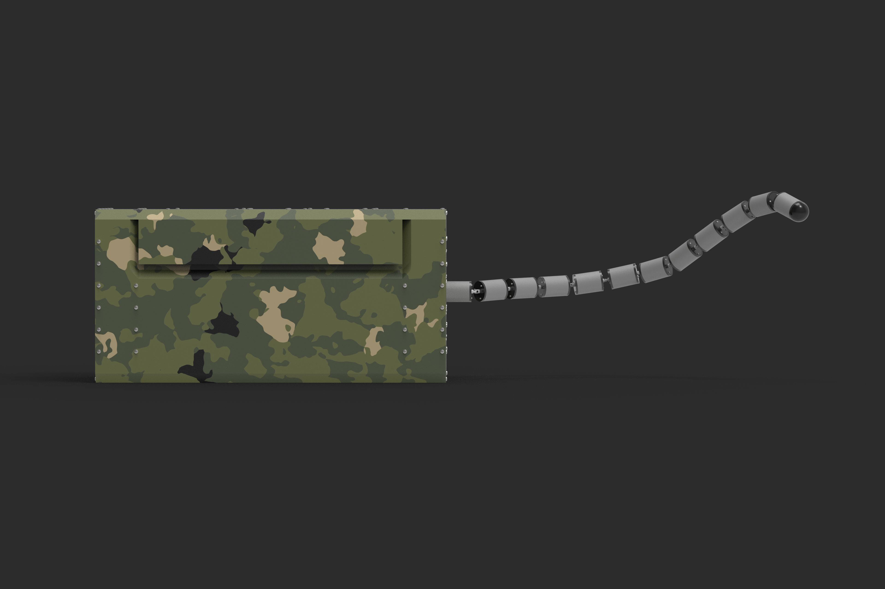

# Armatrix Team Page

Armatrix Team Page is a full-stack project for the Armatrix robotics website. It combines a cinematic Next.js frontend with a FastAPI backend that serves team member data.

The frontend includes a landing page, animated sections, brand assets, and a team directory. The backend exposes REST endpoints for reading and managing team member records.

## Live deployments

- Frontend: `https://armatrix-team-page-three.vercel.app`
- Backend: `https://armatrix-team-page.onrender.com`

## Tech stack

### Frontend

- Next.js 14 App Router
- React 18
- TypeScript
- Tailwind CSS
- Framer Motion
- Axios

### Backend

- FastAPI
- Pydantic
- Uvicorn

## Architecture

The project is split into two applications:

- `frontend/` contains the public website and team UI.
- `backend/` contains the FastAPI service and in-memory team data store.

### Request flow for team data

The team page does not call the deployed backend directly from the browser.

Instead, the flow is:

1. The browser requests `GET /api/team` from the Next.js frontend.
2. The Next.js route handler in `frontend/app/api/team/route.ts` proxies that request to the backend.
3. The backend responds from `GET /team`.
4. The frontend renders the returned team member data.

This avoids browser-side CORS issues between Vercel and Render.

## Project structure

```text
.
├── README.md
├── backend/
│   ├── app/
│   │   ├── api/routes/
│   │   ├── data/
│   │   └── schemas/
│   ├── main.py
│   └── requirements.txt
└── frontend/
	├── app/
	│   ├── api/team/route.ts
	│   ├── page.tsx
	│   ├── team/page.tsx
	│   └── layout.tsx
	├── components/
	├── public/
	├── services/
	├── lib/
	└── package.json
```

### Key files

```text
backend/main.py                      FastAPI app entrypoint and CORS setup
backend/app/api/routes/team.py      Team REST API routes
backend/app/data/team_store.py      In-memory team member store
frontend/app/page.tsx               Main landing page
frontend/app/team/page.tsx          Team directory page
frontend/app/api/team/route.ts      Next.js proxy route to backend /team
frontend/components/HeroSection.tsx Hero section and glass console UI
frontend/components/TeamGrid.tsx    Team loading, error, grid, and detail panel
frontend/services/api.ts            Frontend API client used by the team UI
frontend/app/layout.tsx             Global metadata, fonts, and favicon
```

## Features

- Cinematic landing page with motion-driven sections
- Branded Armatrix assets and favicon support
- Responsive design for desktop and mobile layouts
- Team directory page with loading, error, and detail-panel states
- FastAPI CRUD endpoints for team members
- Next.js server-side proxy for backend team requests
- Deployable split architecture using Vercel + Render

## Product visuals

These images are part of the repository and are used across the landing page experience.

<p align="center">
	
	
	
</p>

<p align="center">
	
	
	
</p>

## Backend API

Base URL in production:

```text
https://armatrix-team-page.onrender.com
```

Available routes:

- `GET /` returns `API running`
- `GET /team` returns all team members
- `GET /team/{member_id}` returns a single team member
- `POST /team` creates a new team member
- `PUT /team/{member_id}` updates an existing team member
- `DELETE /team/{member_id}` deletes a team member

## Local development

### Prerequisites

- Node.js 18 or newer
- npm
- Python 3.10+ recommended

### 1. Start the backend

```bash
cd backend
python -m venv .venv
.venv\Scripts\activate
pip install -r requirements.txt
uvicorn main:app --reload
```

The backend will run at:

```text
http://localhost:8000
```

### 2. Start the frontend

```bash
cd frontend
npm install
npm run dev
```

The frontend will run at:

```text
http://localhost:3000
```

Team page locally:

```text
http://localhost:3000/team
```

## Frontend scripts

Run these from `frontend/`:

- `npm run dev` starts Next.js development server
- `npm run dev:clean` clears `.next/cache` and starts dev server
- `npm run build` creates the production build
- `npm run start` starts the production server
- `npm run lint` runs Next.js ESLint checks
- `npm run clean:next` removes the local Next.js cache

## Environment variables

### Frontend

The frontend proxy reads this value:

- `NEXT_PUBLIC_API_BASE_URL`

Example:

```env
NEXT_PUBLIC_API_BASE_URL=https://armatrix-team-page.onrender.com
```

If not provided, the current frontend proxy fallback is:

```text
https://armatrix-team-page.onrender.com
```

### Backend

The backend supports:

- `CORS_ORIGINS`

Example:

```env
CORS_ORIGINS=https://armatrix-team-page-three.vercel.app
```

You can also provide a comma-separated list:

```env
CORS_ORIGINS=https://armatrix-team-page-three.vercel.app,https://your-custom-domain.com
```

If `CORS_ORIGINS=*`, the backend allows all origins and disables credentials automatically.

## Deployment

### Frontend on Vercel

1. Import the GitHub repository into Vercel.
2. Set the root directory to `frontend`.
3. Add environment variable `NEXT_PUBLIC_API_BASE_URL`.
4. Deploy.

Recommended value:

```env
NEXT_PUBLIC_API_BASE_URL=https://armatrix-team-page.onrender.com
```

### Backend on Render

1. Create a new Web Service from the same repository.
2. Set the root directory to `backend`.
3. Use the install command:

```bash
pip install -r requirements.txt
```

4. Use the start command:

```bash
uvicorn main:app --host 0.0.0.0 --port $PORT
```

5. Add `CORS_ORIGINS` with your frontend URL.

Recommended value:

```env
CORS_ORIGINS=https://armatrix-team-page-three.vercel.app
```

## Production notes

- The frontend team page fetches through `frontend/app/api/team/route.ts`.
- This proxy keeps browser requests same-origin and reduces CORS failures.
- The backend currently uses an in-memory data store, so data resets when the backend restarts or redeploys.

## Troubleshooting

### Team page says "Unable to load team members"

Check the following:

1. The backend is live at `https://armatrix-team-page.onrender.com/team`.
2. The frontend proxy route is deployed and reachable at `/api/team`.
3. `NEXT_PUBLIC_API_BASE_URL` points to the correct backend.
4. `CORS_ORIGINS` includes your deployed frontend domain.

### Next.js cache errors on Windows

If local development shows cache rename errors inside `.next/cache`, run:

```bash
cd frontend
npm run dev:clean
```

### Favicon or static assets do not update after deploy

Try a hard refresh or open the deployed site in an incognito window. Browsers often cache icons aggressively.

## Current limitations

- Team data is stored in memory only
- Image optimization warnings still exist for several `img` tags
- The backend has no persistent database yet

## Contributing

### Workflow

1. Pull the latest changes from `main`.
2. Create a branch for your work.
3. Make focused changes and avoid mixing unrelated fixes.
4. Run the relevant local checks before pushing.
5. Open a pull request with a short summary of what changed and how it was tested.

### Recommended local checks

Frontend:

```bash
cd frontend
npm run build
npm run lint
```

Backend:

```bash
cd backend
uvicorn main:app --reload
```

Then verify these manually:

- Landing page loads correctly
- `/team` loads team members
- Team member detail panel opens and closes correctly
- Deployed API/proxy assumptions have not been hardcoded back to localhost

### Contribution guidelines

- Keep UI changes responsive for both desktop and mobile
- Preserve the existing visual style unless the task explicitly changes design
- Prefer small, targeted commits
- Do not commit large binary assets unless they are necessary and safe for Git hosting
- Keep deployment-related URLs and environment-variable usage consistent with this README

## Future improvements

- Replace remaining `img` tags with `next/image`
- Add persistent storage for team data
- Add automated tests for frontend and backend
- Add CI checks for build and lint on pull requests
